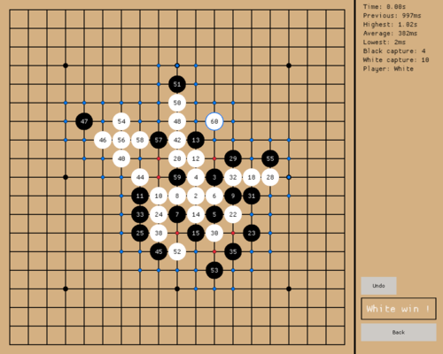
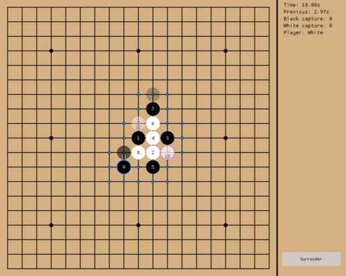

# gomoku

The goal of this project is to make a computer play the game of [Gomoku](https://en.wikipedia.org/wiki/Gomoku), using the [Minimax](https://en.wikipedia.org/wiki/Minimax) algorithm.

Three game modes are available, a Player-vs-Player mode, with hints from the computer, a Player-vs-Computer mode and a Computer-vs-Computer mode.

<table>
  <tr>
    <td>Screen after a game is over</td>
     <td>Highlighted last move and recommended moves in PvP mode</td>
  </tr>
  <tr>
    <td></td>
    <td></td>
  </tr>
 </table>

## Features

* 3 modes, **Player-vs-Player**, **Player-vs-Computer** and **Computer-vs-Computer**
* Generate recommended moves and show all generated moves
* Highlight the last move and display an undo button after a game is over to rewind the game
* Disable and enable the optional rules in the options
* Selectable algorithm between Minimax, Negamax and a Greedy algorithm that choose the first move from the heuristic
* Three difficulties level that change the depth of the algorithm

## Requirements

The minimum requirements are the same as [macroquad](https://github.com/not-fl3/macroquad), which you can find [here](https://github.com/not-fl3/macroquad#build-instructions).

## Usage

You can start and play with a simple ``cargo run --release``, and change the options in the options menu.

There is a single feature that you can *enable*:

* ``--features cli_ava`` which will play a single game in AvA mode with all default options and display the output in the terminal only.

## Resources

* https://en.wikipedia.org/wiki/Gomoku
	* https://en.wikipedia.org/wiki/Go_%28game%29
* Extra rules:
	* https://en.wikipedia.org/wiki/Gomoku#Ninuki-renju
	* https://en.wikipedia.org/wiki/Gomoku#Pente
	* https://en.wikipedia.org/wiki/Gomoku#Omok (*three and three*/*double three* rule)
* https://en.wikipedia.org/wiki/Minimax
	* https://en.wikipedia.org/wiki/Minimax#Combinatorial_game_theory
	* https://en.wikipedia.org/wiki/Alpha%E2%80%93beta_pruning
* Publications
	* https://dr.lib.iastate.edu/server/api/core/bitstreams/39a805d5-8f5b-41e6-b07c-19c07229f813/content
	* https://digikogu.taltech.ee/en/Download/14c4d37a-d728-4263-8d47-3371baf62b85
